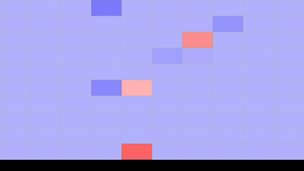

# Simple C# Animation

The BlocksAnimation project is a WPF application that creates a grid of rectangles and animates their colors and opacity. The animation involves filling the grid with colored rectangles and then clearing them, with the speed of the animation changing dynamically.

